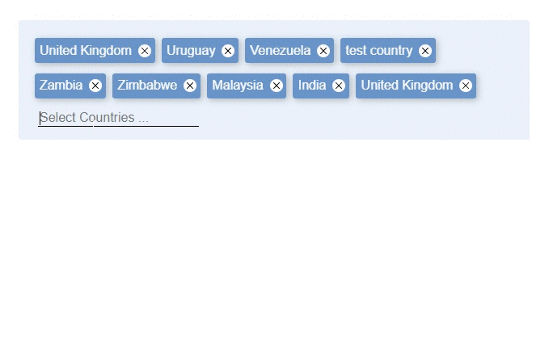

<!-- [![NPM Version][npm-image]][npm-url]-->
<!-- [![Downloads Stats][npm-downloads]][npm-url] -->

<div align="center">
  
</div>

<br />

[](https://dev.azure.com/prabhummurthy/smart-tagz/_build/latest?definitionId=4&branchName=master)
[](https://www.codacy.com/manual/prabhuignoto/smart-tagz?utm_source=github.com&utm_medium=referral&utm_content=prabhuignoto/smart-tagz&utm_campaign=Badge_Grade)
[](https://deepscan.io/dashboard#view=project&tid=10074&pid=13324&bid=220204)
[](https://lgtm.com/projects/g/prabhuignoto/smart-tagz/context:javascript)

[](https://depfu.com/github/prabhuignoto/smart-tagz?project_id=18158)

<div align="center">
  
</div>

[](https://codesandbox.io/s/smart-tagz-pd32g?fontsize=14&hidenavigation=1&theme=dark)

<h2>✨ Features</h2>

- ⚡ [Autosuggest](#auto-suggest) with support for keyboard selection.
- ✏️ [Edit](#editable-tags) the tags inline by double clicking them.
- 🏷️ [Paste](#paste) strings with delimiters of your choice and the component will create the tags for you.
- 🗑️ Quickly delete the tags with a visual confirmation before removing a tag.
- 🧹 Quickly clear all tags with `quick-delete` mode.
- 🔒 &nbsp;[Lock the component](#readonly-tags) using the `readonly` mode.
- ✋ &nbsp;[Restrict](#max-tags) the number of tags and Handle duplicates gracefully.
- 🌈&nbsp;[Customize](#theme) the colors.

### Table of Contents

- [⚡ Installation](#-installation)
- [🚀 Getting Started](#-getting-started)
- [🍬 Demos](#-demos)
- [Props](#props)
  - [Default Tags](#default-tags)
  - [Duplicates](#duplicates)
  - [Auto Suggest](#auto-suggest)
  - [Max Tags](#max-tags)
  - [Paste](#paste)
  - [Editable Tags](#editable-tags)
  - [Readonly Tags](#readonly-tags)
  - [Theme](#theme)
- [📦 Build Setup](#-build-setup)
- [🔨 Contributing](#-contributing)
- [Notes](#notes)
- [Meta](#meta)

## ⚡ Installation

```sh
yarn install smart-tagz
```

## 🚀 Getting Started

smart-tagz has some great defaults to get you started quickly. Please check the props list for all options.

```sh
<template>
  <smart-tagz
    autosuggest
    editable
    inputPlaceholder="Select Countries ..."
    :sources="sources"
    :allowPaste="{delimiter: ','}"
    :allowDuplicates="false"
    :maxTags="20"
    :defaultTags="['United Kingdom', 'Uruguay', 'Uzbekistan']"
  />
</template>

<script>
import { SmartTagz } from "smart-tagz";
import "smart-tagz/dist/smart-tagz.css";

import { defineComponent } from "vue";

export default defineComponent({
  name: "Basic",
  components: {
    SmartTagz,
  }
});
</script>
```

## 🍬 Demos

Head to our demo page for examples showcasing all the features.

[https://smart-tagz.vercel.app/](https://smart-tagz.vercel.app/)

## Props

| Prop             | Type                  | Description                                                                                      | Default          |
| ---------------- | --------------------- | ------------------------------------------------------------------------------------------------ | ---------------- |
| defaultTags      | Array                 | initialize with a `default` set of tags                                                          | []               |
| width            | String                | `width` of the container                                                                         | 100%             |
| autosuggest      | Boolean               | Enables the `autosuggest` feature. you also need to set the sources for the autosuggest to work. | false            |
| sources          | Array                 | Works as the `datasource` for the autosuggest feature                                            | []               |
| allowPaste       | { delimiter: String } | Parses the pasted string based on the passed delimiter and creates tags automatically            | {delimiter: ","} |
| editable         | Boolean               | makes the tags `editable`                                                                        | false            |
| allowDuplicates  | Boolean               | allows/disallows `duplicate` tag entries while pasted or entered manually.                       | true             |
| maxTags          | Number                | sets the `Maximum` number of tags                                                                | 10               |
| inputPlaceholder | String                | `Placeholder` for the input box.                                                                 | "Enter tag..."   |
| readOnly         | Boolean               | Makes the whole component `readOnly`. ideal for display only purposes.                           | false            |
| quick-delete     | Boolean               | When enabled all the tags can be cleared by <kbd>CTRL</kbd> + <kbd>A</kbd>, <kbd>DEL</kbd>       | false            |
| on-changed       | Function              | `callback` that gets called when a new tag is added or an existing tag is deleted                | false            |

### Default Tags

We can initialize smart-tagz with some `default` tags. This setting will mostly be used along with the `readonly` prop to create tags for display only purposes.

```sh
<smart-tagz :default-tags="['United Kingdom', 'Uruguay', 'Uzbekistan']" />
```

### Duplicates

You can decide how to manage `duplicate` tags by either allowing or disallowing them completely. When set to `false` no duplicate values are allowed.

```sh
<smart-tagz :allow-duplicates="false" />
```

### Auto Suggest

Whe set to `true`, the `autosuggest` prop suggests values in a dropdown. You also need to set the `sources` prop for this to work. The `sources` prop can be an Array of strings.

```sh
 <smart-tagz autosuggest :sources="['India', 'Brazil', 'China', 'United Kingdom']" />
```

### Max Tags

The component can also be configured to accept the `Maximum` number of tags that can be created. Once the threshold is reached, the input will be `hidden` from the user.

Here we restrict the tags to `3`

```sh
<smart-tagz :max-tags="3" />
```

### Paste

The component can parse strings and automatically create tags for you. The default delimiter is `","` but you can override this setting by manually setting the `delimiter` option.

```sh
<smart-tagz :allow-paste="{delimiter: ';'}" />
```

### Editable Tags

The Tags are not `editable` by default, but you can change this setting with the `editable` prop. Simply double click a tag, make the changes and hit enter to save.

```sh
<smart-tagz editable />
```

### Readonly Tags

You can lock the component with `readonly` mode. All interactions are disabled in `read-only` mode.

```sh
<smart-tagz read-only />
```

### Theme

The components color scheme can be customized by passing a custom theme prop.

```sh
  <smart-tagz
    :theme="{
      primary: '#545454',
      background: '#bdbdbd',
      tagTextColor: '#fff',
    }"
  />
```

## 📦 Build Setup

```bash
# install dependencies
yarn install

# start dev
yarn run dev

# package lib
npm run rollup

# run css linting
yarn run lint:css
```

## 🔨 Contributing

1. Fork it ( [https://github.com/prabhuignoto/smart-tagz/fork](https://github.com/prabhuignoto/smart-tagz/fork) )
2. Create your feature branch (`git checkout -b new-feature`)
3. Commit your changes (`git commit -am 'Add feature'`)
4. Push to the branch (`git push origin new-feature`)
5. Create a new Pull Request

## Notes

The project uses [vite](vite) instead of @vue/cli. I choose vite for speed and i also believe [vite](vite) will be the future.

## Meta

Prabhu Murthy – [@prabhumurthy2](https://twitter.com/prabhumurthy2) – prabhu.m.murthy@gmail.com

Distributed under the MIT license. See `LICENSE` for more information.

[https://github.com/prabhuingoto/](https://github.com/prabhuingoto/)

<!-- Markdown link & img dfn's -->

[vue]: https://vuejs.org
[typescript]: https://typescriptlang.org
[vite]: https://github.com/vitejs/vite
