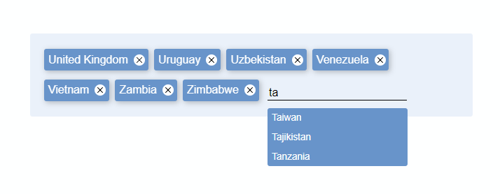

# smart-tagz

<!-- [![NPM Version][npm-image]][npm-url]-->
<!-- [![Downloads Stats][npm-downloads]][npm-url] -->
[](https://dev.azure.com/prabhummurthy/smart-tagz/_build/latest?definitionId=4&branchName=master)
[](https://www.codacy.com/manual/prabhuignoto/smart-tagz?utm_source=github.com&amp;utm_medium=referral&amp;utm_content=prabhuignoto/smart-tagz&amp;utm_campaign=Badge_Grade)
[](https://deepscan.io/dashboard#view=project&tid=10074&pid=13324&bid=220204)
[](https://depfu.com/github/prabhuignoto/boxd?project_id=13611)

Smart input tags for Vue 3



## About

smart-tagz is a smart input tags components built for Vue 3.

## Features

- **Autocomplete** - Supports autocomplete with easy keyboard selection.
- **Editable Tags** - Tags can be edited inline by double clicking on the tag. 
- **Create tags on Paste** - Paste string with delimiters of your choice and the component will auto create the tags for you.
- **Easy tag deletion** - Delete tags easily with delete or backspace.
- **Quick delete** - Quickly delete all tags with CTRL + A, DEL or BACKSPACE.
- **Composition API** - Built using the latest Composition API from Vue 3.
- **Typescript** - Built with Typescript.

## Installation

```sh
yarn run install && yarn run dev
```

## Getting Started

smart-tagz has some great defaults to get you started quickly. Please check the props list for details on all available options.

```sh
  <SmartTagz
    :autosuggest="true"
    :sources="sources"
    :allowPaste="{delimiter: ','}"
    :editable="true"
    :allowDuplicates="false"
    :maxTags="20"
    :defaultTags="['United Kingdom', 'Uruguay', 'Uzbekistan']"
    inputPlaceholder="Select Countries ..."
  />
```


## Props

| Prop             | Type                  | Description                                                                                    | Default          |
|------------------|-----------------------|------------------------------------------------------------------------------------------------|------------------|
| defaultTags      | Array                 | can be initialized with a default set of tags                                                  | []               |
| width            | String                | width of the container                                                                         | 100%             |
| autosuggest      | Boolean               | Enables the autosuggest feature. you also need to set the sources for the autosuggest to work. | false            |
| sources          | Array                 | Works  as the datasource for the autosuggest feature                                           | []               |
| allowPaste       | { delimiter: String } | Parses the pasted string based on the passed delimiter string and creates tags automatically   | {delimiter: ","} |
| editable         | Boolean               | makes the tags editable                                                                        | false            |
| allowDuplicates  | Boolean               | allows/disallows duplicate tag entries while pasted or entered manually                        | true             |
| maxTags          | Number                | Maximum number of tags allowed                                                                 | 10               |
| inputPlaceholder | String                | Placeholder for the input box                                                                  | "Enter tag..."   |
| readOnly         | Boolean               | Makes the whole component readonly. ideal for display only purposes.                           | false            |

## Built with

- [Vue.JS](vue) - The Component is written in Vue + [Typescript](typescript).

## Notes

- The component is built using the RC version of Vue 3 and heavily relies on the composition API.
- The project uses [vite](vite) instead of @vue/cli. I choose vite for speed and i also believe [vite](vite) will be the future.

## Meta

Prabhu Murthy – [@prabhumurthy2](https://twitter.com/prabhumurthy2) – prabhu.m.murthy@gmail.com

Distributed under the MIT license. See `LICENSE` for more information.

[https://github.com/prabhuingoto/](https://github.com/prabhuingoto/)

<!-- Markdown link & img dfn's -->

[vue]: https://vuejs.org
[typescript]: https://typescriptlang.org
[vite]: https://github.com/vitejs/vite